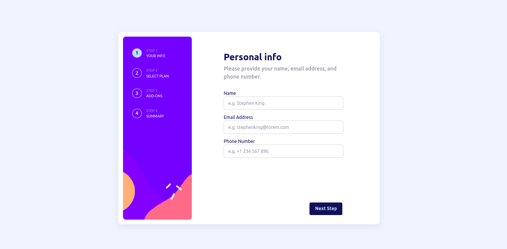

# Frontend Mentor - Multi-step form solution

This is a solution to the [Multi-step form challenge on Frontend Mentor](https://www.frontendmentor.io/challenges/multistep-form-YVAnSdqQBJ). Frontend Mentor challenges help you improve your coding skills by building realistic projects.

## Table of contents

- [Overview](#overview)
  - [The challenge](#the-challenge)
  - [Screenshot](#screenshot)
  - [Links](#links)
- [My process](#my-process)
  - [Built with](#built-with)
  - [What I learned](#what-i-learned)
  - [Continued development](#continued-development)
  - [Useful resources](#useful-resources)
- [Author](#author)

## Overview

### The challenge

Users should be able to:

- Complete each step of the sequence
- See a summary of their selections on the final step and confirm their order
- View the optimal layout for the interface depending on their device's screen size
- See hover and focus states for all interactive elements on the page

### Screenshot



### Links

- Solution URL: [Add solution URL here](https://your-solution-url.com)
- Live Site URL: [Add live site URL here](https://your-live-site-url.com)

## My process

### Built with

- Semantic HTML5 markup
- Flexbox
- CSS Grid
- Mobile-first workflow

### What I learned

I finally saw some use cases for the :has and :is pseudo classes and made made good use of it in cases such as:

```css
.personal-info-form > label > input:is(:active, :focus, :focus-visible) {
  outline: 1px solid var(--clr-purplish-blue);
}

.plan:has(input[type='radio']:checked) {
  background: var(--clr-alabaster);
  outline: 1px solid var(--clr-purplish-blue);
}
```

### Continued development

I'm still not completely comfortable with writing semantic HTML and improving accessibility and I plan to continue working on it

### Useful resources

- [Andy Bell's CSS Reset](https://piccalil.li/blog/a-modern-css-reset) - This is so far my best CSS reset. It resets the sizes of headings(h1-6) so I can focus more on writing semantic HTML rather tham trying to use HTML to make the site look better.

## Author

- Frontend Mentor - [@Leeyah-123](https://www.frontendmentor.io/profile/Leeyah-123)
- Twitter - [@JunaidAaliyah](https://www.twitter.com/JunaidAaliyah)
